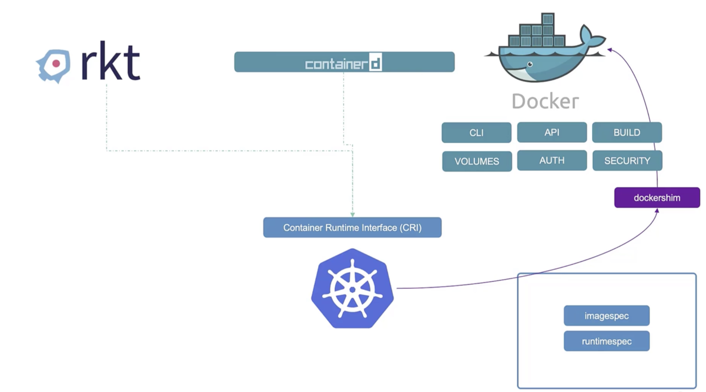
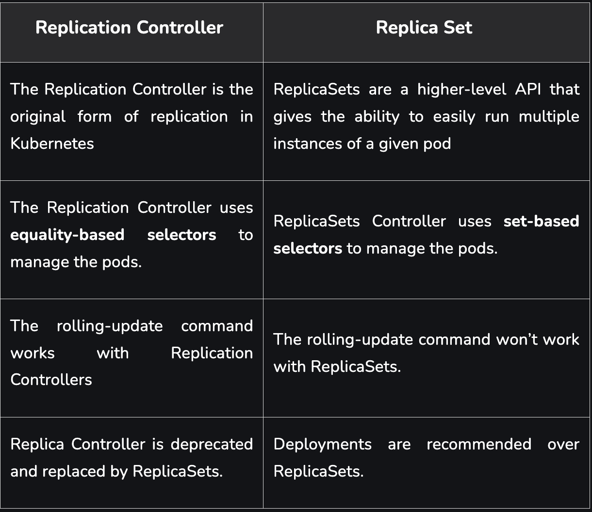
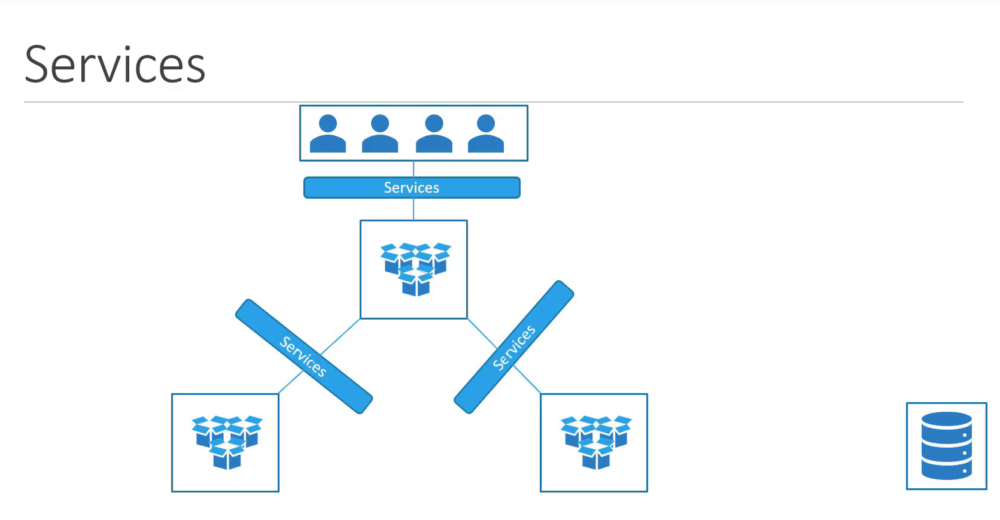
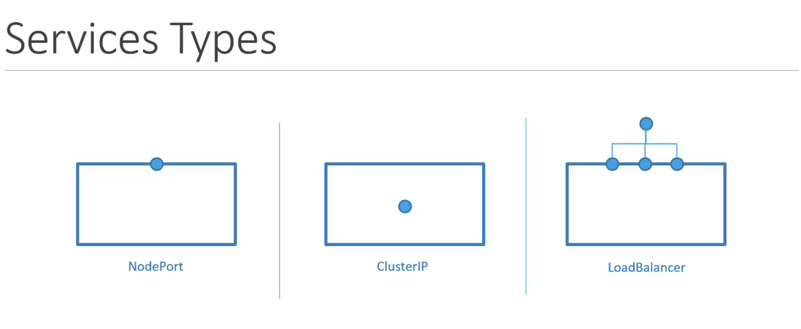
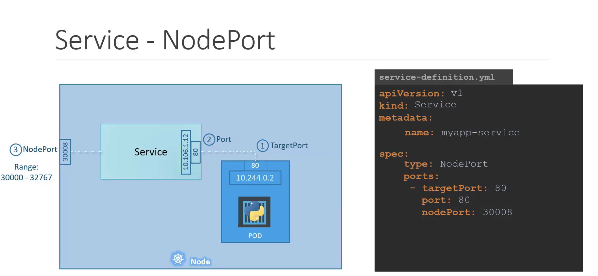
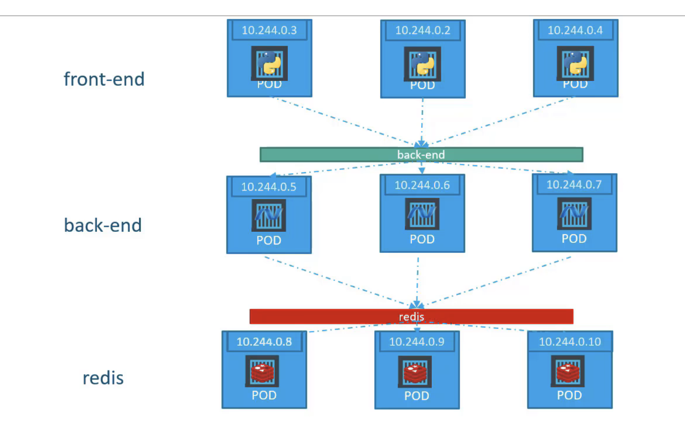

# **Core Concepts Notes**

## **Docker vs ContainerD**

Docker (2013) was the first released container technology before the kubernetes (2014) and also the popular one was/is docker so that Kubernetes was using dockershim to use docker in their system even if Docker isn't eligable for OCI (Open container Initiative) but Docker is using container runtime called **containerd** that is eligable for OCI. In **1.24** version, kubernetes drop the dockershim version instead of supporting and continues with containerd. 

If you want to use cli, you need to use **ctr** 

or, **nerdctl** for provide a Docker-like CLI for containerd

or, **crictl** for provide all CRI compatible container runtimes.

## **Kubernetes Architecture**

### Kube Controller Manager
This manager offices continuesly
* Watch status of the nodes with **kube-apiserver**
* Remediate situation with various controllers
    * Deployment Controller
    * Namespace Controller
    * Endpoint Controller
    * Job Controller
    * Service-Account Controller
    * Node Controller
    * PV-Binder Controller
    * PV-Protection Controller
    * Replication Controller
    * Cronjob
    * Stateful Set
    * Replicaset

### ETCD Cluster
* ETCD is distributed reliable key-value store that is simple, secure and fast.
* To manage etcd, you need to use **etcdctl** cli tool.
* Every information is stored in etcd like infos of Nodes, PODs, configs etc.

### kube-apiserver
It is the primary master node api server. When request that it comes from nodes; 
* It is going to validate and retrives data from etcd to send as response 
* Update etcd data.
* Send request to another services like kube-scheduler etc. 
### kube-scheduler
It is only decide which pod needs to go which node when pod is created and not assigned.
* It can filter nodes for your pods according to CPU or RAM usage etc.
* It can rank nodes on sorted way by your rules.
* It can contain some topics like
    * Resource Requirements and Limits
    * Taints and Tolerations
    * Node Selectors/Affinity
### kubelet
It lead all activities about node itself, contact with master node and load or unload containers in the node.

* Register Node
* Create PODs
* Monitor Node & PODs

### kube-proxy
Its job is to look for new services and it creates appropriate rules on each node to forward traffic to those services

## **API Primitives**

**Control Plane:** It manages Kubernetes clusters and the workloads running on them. Include components like the API Server, Scheduler, and Controller Manager.

**Data Plane:** It is a machines that can run containerized workloads. Each node is managed by the kubelet, an agent that receives commands from the control plane.

### Nodes
A Node is a worker machine in Kubernetes and may be either a virtual or a physical machine, depending on the cluster. Each Node is managed by the control plane. A Node can have multiple pods, and the Kubernetes control plane automatically handles scheduling the pods across the Nodes in the cluster.

A cluster can scale up to 5000 nodes.

### PODs
A pod is a smallest object and single instance of an application. You can have one or more containers in your pod.

### Replica Set

**Replication Controller:** It ensures that a specified number of pod replicas are running at any one time. In other words, a it makes sure that a pod or a homogeneous set of pods is always up and available.

**Replica Set**: It declared in the same way as Replication Controller except that they have more options for the selectors. The Selector is mandatory for Replica sets as match labels you can provide the pod labels to query the pods to match with the replica count.

* High Avaliablity
* Load Balancing
* Scaling

## Services

Services enable communication between various components within and outside of the application.

### **Service Types:**

* **NodePort:**
    
    It work as a service that makes an internal port accesible on a port on the node.

    * At least 3 port needed. As a view of service!
        * TargetPort : Target Pod's port number where The service is forward requests to it.
        * Port: Service's opened port that accepts request from it.
        * NodePort: Node's port to access external 
    * NodePorts only have valid range of 30.000 to 32.767
    * In any case, the service is created exactly the same whether it be a;
        * Single Pod on a Single Node
        * Multiple Pods on a Single Node
        * Multiple Pods on a Multiple Nodes
    
    

* **ClusterIP:**
    
     It can help to group the pods together and provide a single interface to access the pods dynamically.

     * TargetPort and Port is needed.
     * Selector is needed to link the ClusterIP service to node.

     